## Welcome to Azure IoT Hub tutorial

This tutorial can be followed on it's own, but I created it as additional material for my talk "Saving the World with IoT", so after watching the presentation, it's easier to do it at home.

### What we are going to do?

The plan is to create an IoT Hub, add a device (run the code in Console App) which will send temperature reading. We want to process telemetry (measurements and data from device) and based on this information send commands to device. And all of that for free.

### Prerequisites

If you don't have an Azure account already, create it [Azure account](https://azure.microsoft.com/en-gb/free/)
We will use Visual Studio Code for generating code and editing it [VS Code](https://code.visualstudio.com/)

### Create IoT Hub

Pick from the list of options IoT Hub, if you haven't created any IoT Hub before, the list will be empty. Press Add button or Create IoT hub.


On basic screen pick your subscription, resources, location and the IoT Hub name, don't finishe yet, as we have to change scale tier.


When you set all the values, go next to Size and Scale part, by default S1 will be selected. We want to use F1: Free tier, it allows you to send 8000 messages per day without paying anything. You are allowed to have only one IoT Hub with this tier, so make sure that you don't run our of messages per day while testing your application.

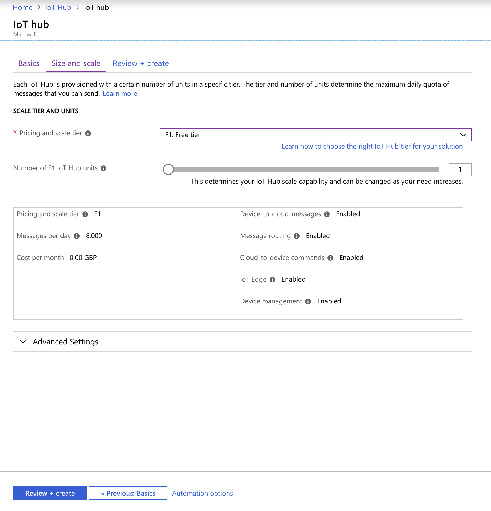

You can press Review + create, make sure all the values are as expected and press Create. It will take about 2 minutes to provision it.

### Create first device

Once IoT Hub is created, we can add our first device. Select your IoT Hub and go to the Explorers sections and press IoT devices. You can see there blue Add button, press it to create a device.

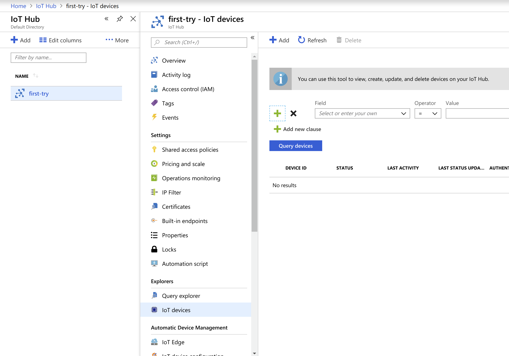

For out case we just have to give our device Id, usually it would be some autogenerated unique value, but to make it easy, we will call it "bedroom".

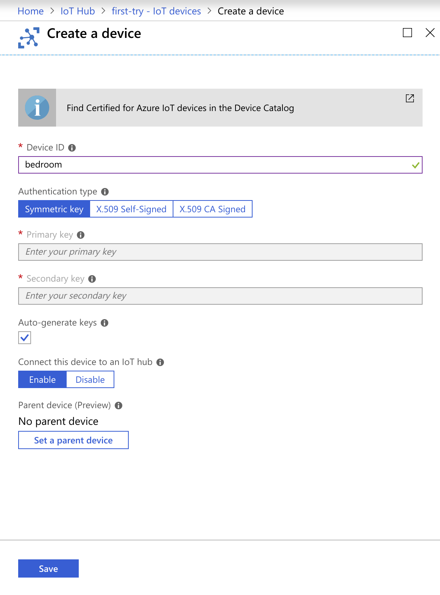

Press Save and device will be created. You can see it on the list.

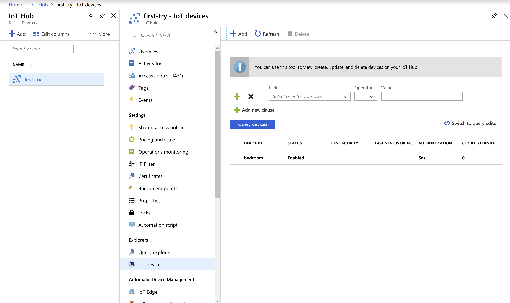

We have everything ready to connect from code, you could write it on your own. To make it easier, we will use VS Code pluggin to generate it.

### Connect from Visual Studio Code

We want to install extension for VS Code called Azure IoT Hub Toolkit.

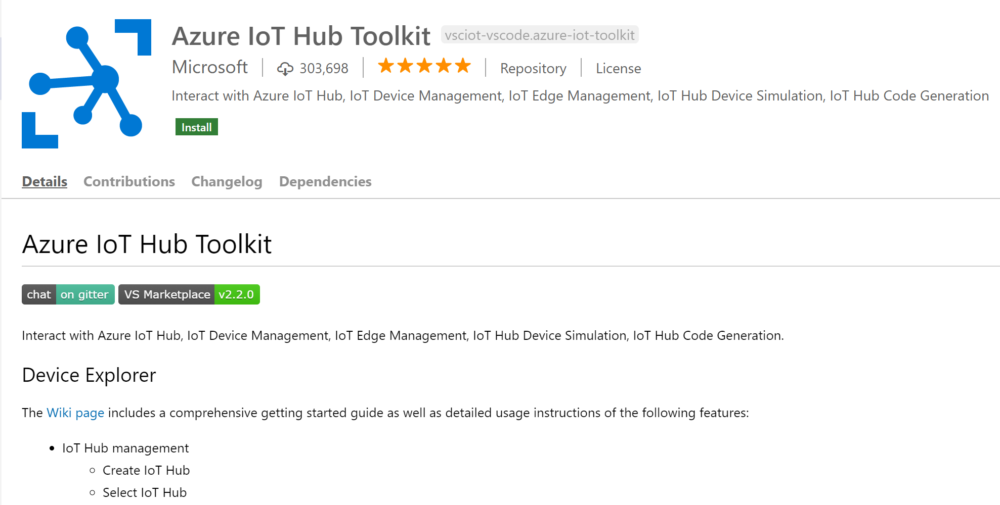

We can connect to IoT Hub.

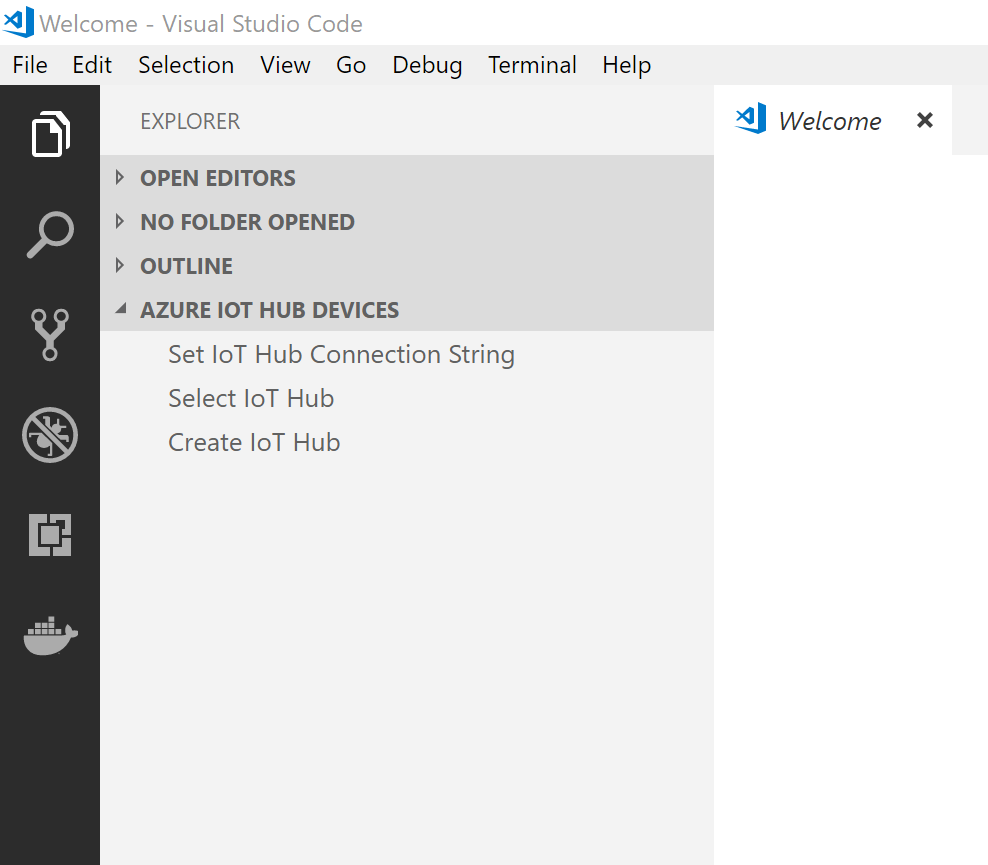

You will be asked to select subscription (you may have to log in first).

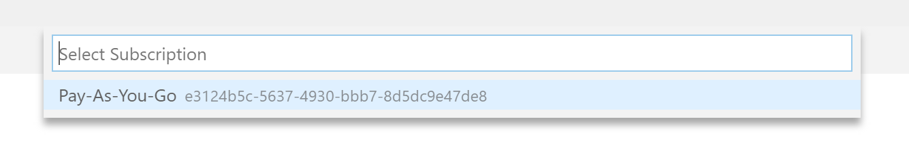

Next pop up will ask for IoT Hub, you will likely have just one on the list, unless you created some before.

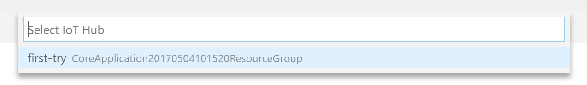

That should result in successful connection and you should see your device's name on the list.

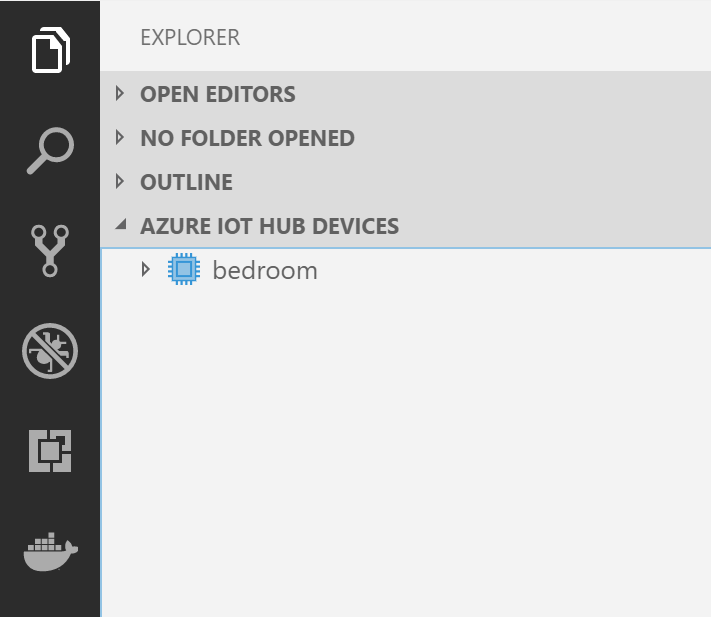

It's time to send a message to a device. Right click on it and look for "Start monitoring C2D Message".

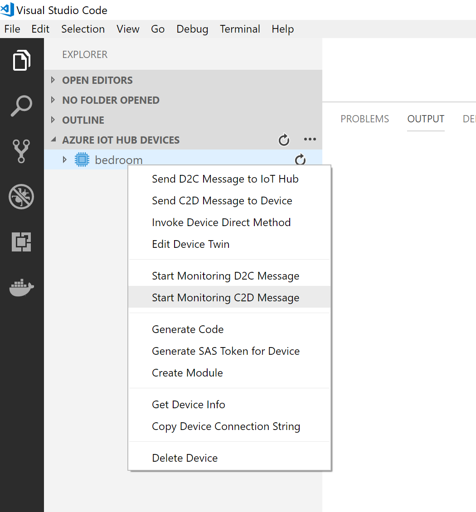

Let's go back to the portal, we will send from there a message to device.

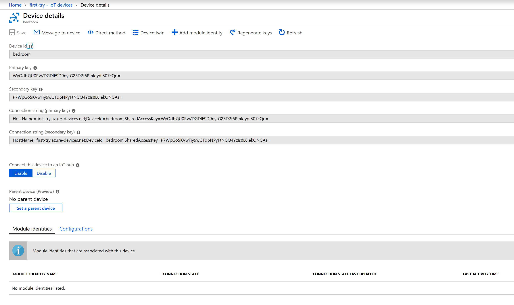

Select "Message to device" tab and send some text.

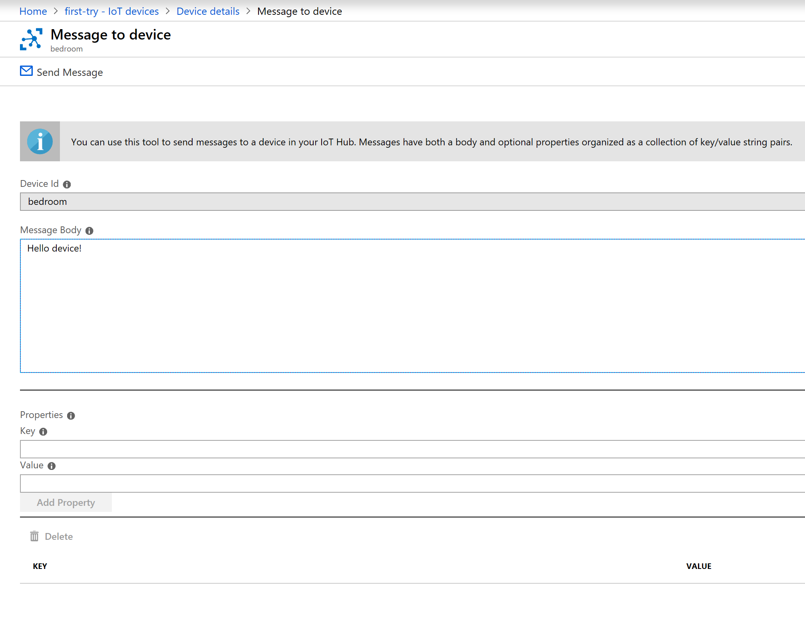

Go back to VS Code, you should now see your message in the output window. When you right click you can stop monitoring.

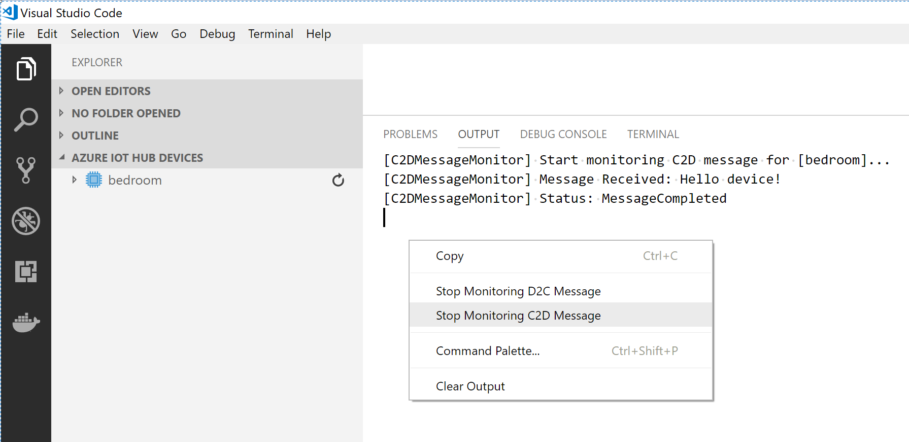

Right click on device name and select "Generate code", you should see a pop up asking for language choice.

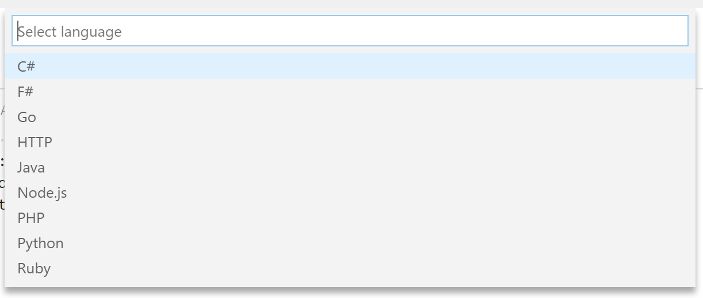

You should see as one option "Send device-to-cloud message". Pick it and save project on your computer.

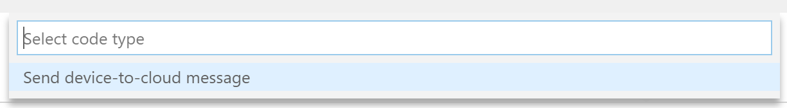

Go back and right click on device name again, this time pick "Start monitoring D2C Message". Go now to your project and run it. Remember to stop your code after few messages, as you have 8000 limit per day for your IoT Hub.

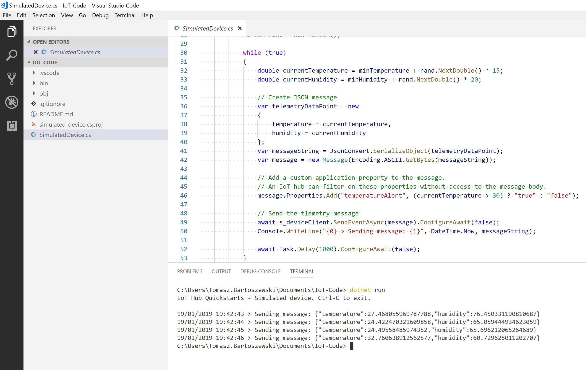

As a result in VS Code with monitoring turned on, you should see messages sent from device.

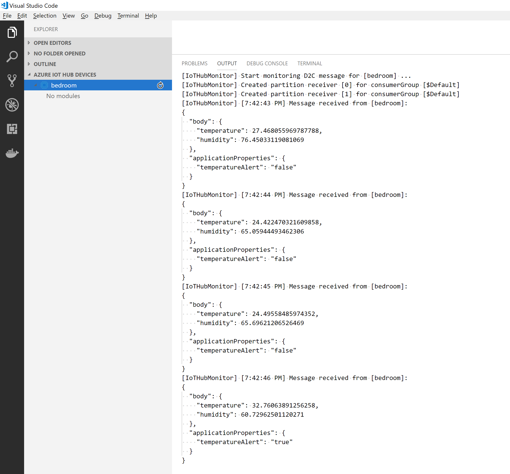

And we now have working code for our device which communicates with IoT Hub.

## Writing code

For the rest of tutorial you will need code from this repository.

[Code on github](https://github.com/tomaszbartoszewski/IoTHub-presentation-examples)

There are few applications. First thing which you will have to do will be generating config files for all of them, you can either copy values from IoT Hub, but I prepared a script which access them using azure cli.

Check this website for installing it
[Azure Cli](https://docs.microsoft.com/en-us/cli/azure/install-azure-cli?view=azure-cli-latest)

Then run this command in powershell:

```
az extension add --name azure-cli-iot-ext
```

Now you can run script, first parameter is name of IoT Hub, second is your device Id:

```
.\generateConfig.ps1 'first-try' 'bedroom'
```

If you don't want to run script, you can generate configs manually. For Device you will need this config.json (you can find device connection string on Device details page):

```
{
    "DeviceConnectionString":  ""
}
```

Place it inside both Device and Device_Processing_Commands directories.

Service require more configuration, you can find it on Built-in endpoints in box Event Hub - compatible endpoint. For IotHubConnectionString go to Shared access policies and select iothubowner (only for this demo, be sensible when running on production):

```
{
    "EventHubsCompatibleEndpoint":  "",
    "IotHubSasKeyName":  "",
    "EventHubsCompatiblePath":  "",
    "IotHubConnectionString":  "",
    "IotHubSasKey":  ""
}
```

Place it inside all 4 Service directories.

Now we can run code.

Every example should work after running

```
dotnet restore; dotnet build; dotnet run
```

### Device directory

It will run device simulator which sends random temperature every second. You can turn on monitoring in Azure IoT Hub Devices extension which we used before.

### Service directory

Continue running Device code. We can now start service processing telemetry. It will display received values on console.

### Service_Just_Id_And_Value directory

It's changed version to display only device Id and it's temperature.

### Service_Send_Command directory

Now it will read temperatures from IoT Hub and send commands to device. Because our Device code can't process commands, it's time to run new code for simulating device.

### Device_Processing_Commands directory

It will now change it's behaviour depending if last command was turn on or off. Turned off it will lower it's temperature with every step, if on it will increase it.

### Service_Send_Command_Ack directory

Our service was not aware if message was delivered correctly, if you would like to get information about messages run this example. You can see it tries to collect feedback in batches instead of getting it one by one.

If you want, try to add one more device to your IoT Hub and run two device simulators at the same time.

Hopefully you enjoyed this tutorial. If you want to learn more, check IoT Hub documentation with different examples [Docs](https://docs.microsoft.com/en-us/azure/iot-hub/)

## Useful links:

[Slides](https://www.slideshare.net/TomaszBartoszewski/saving-the-world-with-iot)

[Recording from London .Net User Group](https://skillsmatter.com/skillscasts/13000-saving-the-world-with-iot)

[Code examples](https://github.com/tomaszbartoszewski/IoTHub-presentation-examples)

This extension is great [Azure IoT Hub Toolkit](https://marketplace.visualstudio.com/items?itemName=vsciot-vscode.azure-iot-toolkit)

If you want to deploy something easily on RPi this is cool website [Balena](https://www.balena.io/) you will run your code in docker, very little setup to connect RPi to it.

If like me you are not good with electronics, this board is great addition to RPi 3: [Sense Hat](https://www.raspberrypi.org/products/sense-hat/)

Code for the RPi demo is very messy, I did hacks until it worked:
[Website - service controlling everything](https://github.com/tomaszbartoszewski/EnergySupervisor)
[Code on RPi](https://github.com/tomaszbartoszewski/LED-RaspberryPi-Python)

[Video of the demo](https://www.youtube.com/watch?v=54Xr9DHUjBY)

## Thank you

Thank you for your time, I hope you enjoyed playing with IoT Hub. Please let me know if something is not clear.

Tomasz Bartoszewski

[Twitter](https://twitter.com/t_bartoszewski)

[Github](https://github.com/tomaszbartoszewski)

QR Code to this website

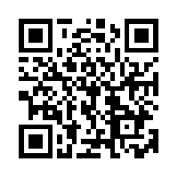