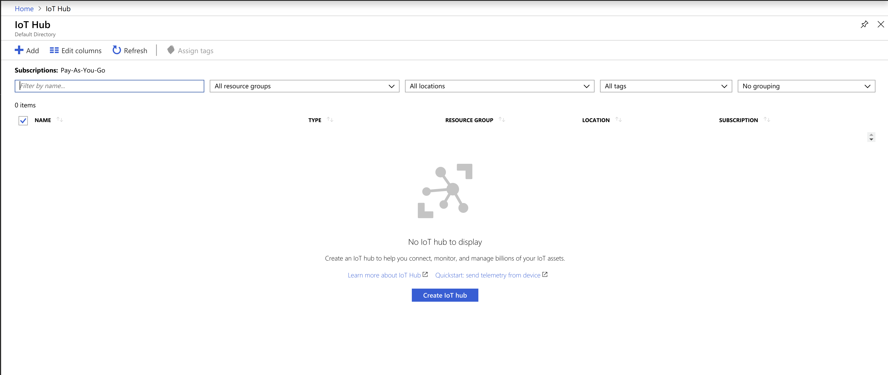
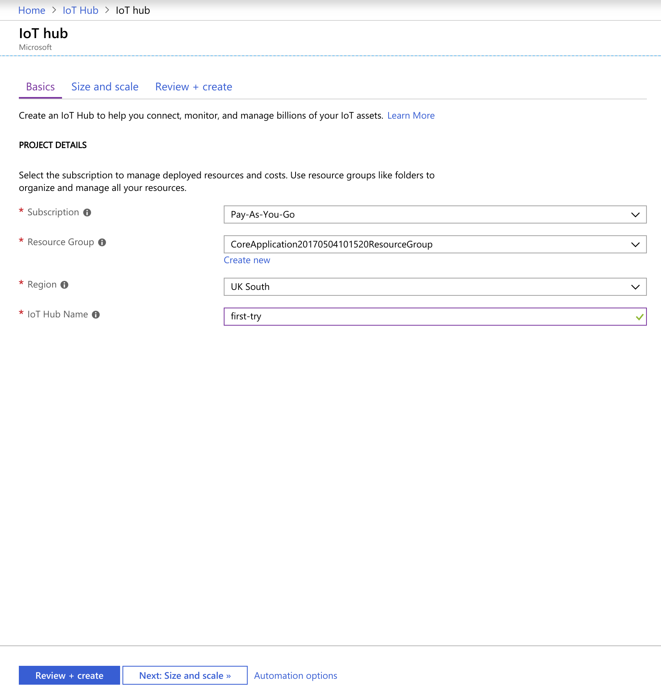

## Welcome to Azure IoT Hub tutorial

This tutorial can be followed on it's own, but I created it as additional material for my talk "Saving the World with IoT", so after watching the presentation, it's easier to do it at home.

### What we are going to do?

The plan is to create an IoT Hub, add a device (run the code in Console App) which will send temperature reading. We want to process telemetry (measurements and data from device) and based on this information send commands to device. And all of that for free.

### Prerequisites

If you don't have an Azure account already, create it now https://azure.microsoft.com/en-gb/free/
We will use Visual Studio Code for generating code and editing it https://code.visualstudio.com/

### Create IoT Hub

Pick from the list of options IoT Hub, if you haven't created any IoT Hub before, the list will be empty. Press Add button or Create IoT hub.



On basic screen pick your subscription, resources, location and the IoT Hub name, don't finishe yet, as we have to change scale tier.



When you set all the values, go next to Size and Scale part, by default S1 will be selected. We want to use F1: Free tier, it allows you to send 8000 messages per day without paying anything. You are allowed to have only one IoT Hub with this tier, so make sure that you don't run our of messages per day while testing your application.


Now you can press Review + create, make sure all the values are as expected and press Create. It will take about 2 minutes to provision it.


----------------


## Welcome to GitHub Pages

You can use the [editor on GitHub](https://github.com/tomaszbartoszewski/IoTHub-tutorial/edit/master/README.md) to maintain and preview the content for your website in Markdown files.

Whenever you commit to this repository, GitHub Pages will run [Jekyll](https://jekyllrb.com/) to rebuild the pages in your site, from the content in your Markdown files.

### Markdown

Markdown is a lightweight and easy-to-use syntax for styling your writing. It includes conventions for

```markdown
Syntax highlighted code block

# Header 1
## Header 2
### Header 3

- Bulleted
- List

1. Numbered
2. List

**Bold** and _Italic_ and `Code` text

[Link](url) and 
```

For more details see [GitHub Flavored Markdown](https://guides.github.com/features/mastering-markdown/).

### Jekyll Themes

Your Pages site will use the layout and styles from the Jekyll theme you have selected in your [repository settings](https://github.com/tomaszbartoszewski/IoTHub-tutorial/settings). The name of this theme is saved in the Jekyll `_config.yml` configuration file.

### Support or Contact

Having trouble with Pages? Check out our [documentation](https://help.github.com/categories/github-pages-basics/) or [contact support](https://github.com/contact) and we’ll help you sort it out.
